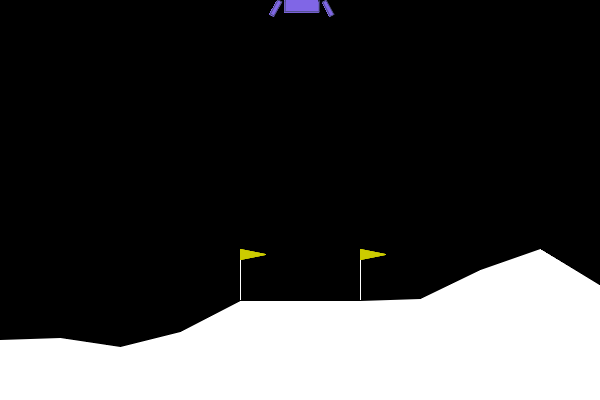

# rl-gymnasium

From-scratch PyTorch implementations of core deep reinforcement learning algorithms with reproducible Gymnasium experiments, saved run artifacts, evaluation scripts, and honest result reporting.

This is a focused RL foundations project. It is not a robotics stack; the robotics relevance is in the engineering habits: deterministic evaluation, seed control, clear metrics, reward curves, checkpoint loading, and documented training behavior.

## Scope

| Algorithm | Environment | Purpose | Current evidence |
|---|---|---|---|
| REINFORCE | CartPole-v1 | Basic policy-gradient baseline | 3 seeds solve CartPole |
| DQN / Double DQN | CartPole-v1 | Value-based RL with replay buffer and target network | 3 seeds hit 500; late regression documented |
| PPO | LunarLander-v3 | Actor-critic RL with GAE and clipped objective | 3 seeds solve LunarLander |

No SAC, TD3, Atari, MuJoCo, Isaac Lab, distributed RL, or robotics simulation is included here.

## Results

| Algorithm | Result summary | Evidence |
|---|---|---|
| REINFORCE | Best deterministic eval reaches 500.0 on all 3 seeds; final eval is 500.0, 493.1, 479.9 | `reinforce/metrics_seed*.csv`, `reinforce/plots/` |
| Double DQN | Best deterministic eval reaches 500.0 on all 3 seeds; seeds 1 and 2 later regress to about 237 and 268 | `dqn/metrics_seed*.csv`, `dqn/plots/` |
| PPO | Final deterministic eval across 3 LunarLander seeds is about 257.3 +/- 14.5 | `ppo/metrics_seed*.csv`, `ppo/plots/` |

PPO rollout:



## Setup

```bash
python -m pip install -e ".[dev]"

# Needed for PPO LunarLander training/video.
python -m pip install -e ".[dev,box2d]"
```

Requires Python 3.10+.

## Portfolio Workflow

Each standardized training run saves:

- `config.yaml`
- `metrics.csv`
- `reward_curve.png`
- `checkpoint.pt`
- `eval_summary.json`

Train through the top-level entrypoint:

```bash
# REINFORCE CartPole
python train.py --algorithm reinforce --seed 0 --out-dir outputs/runs/reinforce_seed0

# DQN CartPole. Double DQN is the default; pass --no-double-dqn for vanilla DQN.
python train.py --algorithm dqn --seed 0 --out-dir outputs/runs/dqn_seed0

# PPO LunarLander
python train.py --algorithm ppo --seed 0 --out-dir outputs/runs/ppo_seed0
```

Evaluate a saved checkpoint:

```bash
python evaluate.py --algorithm ppo \
    --checkpoint outputs/runs/ppo_seed0/checkpoint.pt \
    --out outputs/runs/ppo_seed0/eval_summary.json
```

Record a PPO LunarLander GIF:

```bash
python record_video.py \
    --checkpoint outputs/runs/ppo_seed0/checkpoint.pt \
    --out outputs/runs/ppo_seed0/rollout.gif
```

The original per-algorithm commands still work:

```bash
python reinforce/train.py --seed 0
python dqn/train.py --seed 0
python ppo/train.py --seed 0
```

## Verification

```bash
make test
make lint
make format-check
make smoke-reinforce
make smoke-dqn
make smoke-ppo
make docker-test
```

`make smoke-ppo` runs one PPO iteration on LunarLander, so install the `box2d` extra first if running it outside Docker.

## Repository Map

| Path | Purpose |
|---|---|
| `train.py` | Unified training entrypoint for REINFORCE, DQN, and PPO |
| `evaluate.py` | Checkpoint evaluation for all algorithms |
| `record_video.py` | PPO LunarLander GIF generation |
| `reinforce/`, `dqn/`, `ppo/` | Algorithm implementations and historical evidence |
| `common/` | Shared seeding, device, logging, and artifact helpers |
| `scripts/plot_csv.py` | Multi-seed CSV plotting utility |
| `tests/` | Fast smoke tests for algorithm update paths |
| `audit.md` | Phase 1 refactor audit |
| `docs/REFACTOR_PLAN.md` | Refactor target and constraints |

## Notes

- Checkpoints are ignored by git because they are generated artifacts.
- The committed CSVs and plots are intentionally kept as lightweight evidence for the reported results.
- DQN's late regression is left visible rather than hidden; the best checkpoint remains useful, but the curve documents the training instability.
- PPO uses `LunarLander-v3`; if your local Gymnasium install only exposes `LunarLander-v2`, use a compatible Gymnasium version or adjust the config intentionally.
