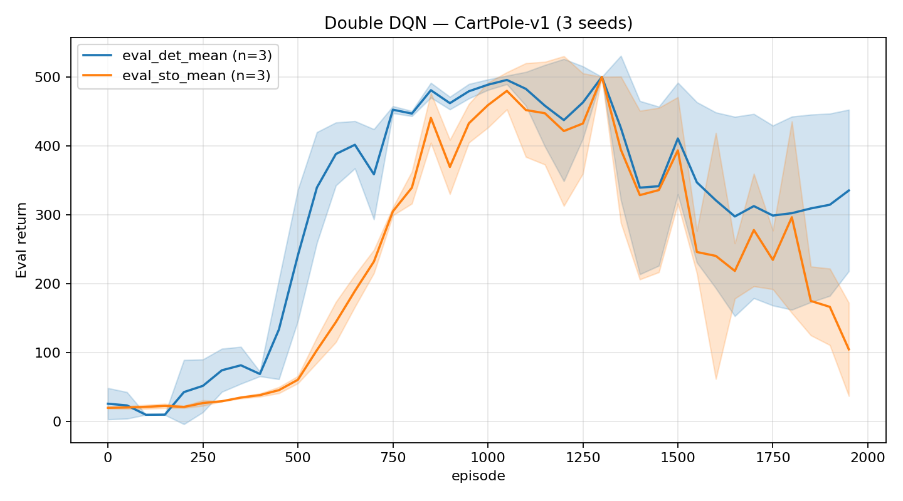
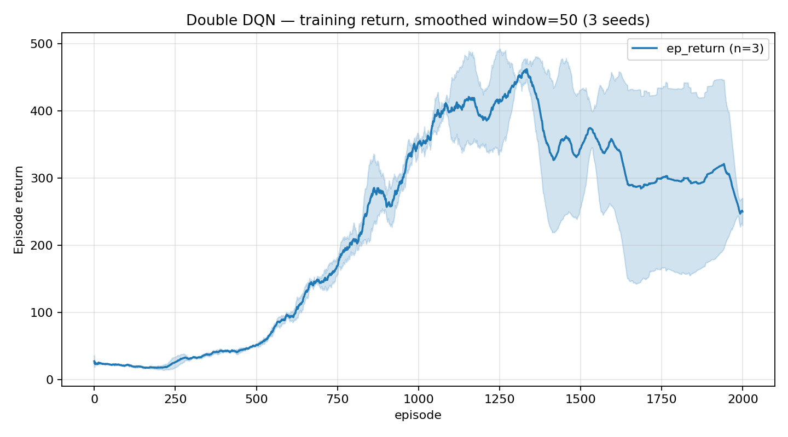

## Double DQN (CartPole-v1)

From-scratch Double DQN in PyTorch + Gymnasium — experience replay, target network, and an optional `--no-double-dqn` flag for vanilla DQN comparison.





### Run

```bash
# Double DQN (default)
python dqn/train.py

# vanilla DQN
python dqn/train.py --no-double-dqn

# specific seed / episode budget
python dqn/train.py --seed 1 --episodes 2000 --device cpu
```

Install first: `pip install -e .` from repo root.

### Hyperparameters

| parameter | value |
|---|---|
| network | 2-layer MLP, 128 hidden, ReLU |
| γ (discount) | 0.99 |
| learning rate | 1e-4 (Adam) |
| batch size | 64 |
| replay buffer | 10 000 transitions |
| learning starts | 1 000 steps |
| ε schedule | 1.0 → 0.01, decay 0.999 per episode |
| target update | every 1 000 env steps (hard copy) |
| eval cadence | every 50 episodes, 20 deterministic rollouts |
| double DQN | on by default (`--no-double-dqn` for vanilla) |

### Results — 3 seeds, CartPole-v1

| seed | first solve (ep) | env steps to solve | best det. eval | final det. eval |
|---|---|---|---|---|
| 0 | 1050 | 129 580 | 500.0 | 500.0 |
| 1 | 1100 | 156 066 | 500.0 | 237.2 |
| 2 | 1050 | 141 347 | 500.0 | 268.2 |

"Solve" = deterministic eval ≥ 499 (CartPole-v1 cap is 500). All three seeds reach it, but seeds 1 and 2 regress — DQN finds the solution and then drifts away from it. The saved best-checkpoint policy is unaffected; this is a training-curve phenomenon visible in the eval plot above.

### Hardware & runtime

Tested on Python 3.10, torch 2.7. Runs CPU-only; ~15–20 min per seed on a modern CPU.

### Why Double DQN?

Standard DQN computes the TD target as:

```
target = r + γ · max_a Q_target(s', a)
```

The `max` over the *target* network's Q-values introduces **max-bias**: in a stochastic environment, the highest Q-value among noisy estimates is systematically higher than the true value. The target network was added to break the feedback loop between the policy and its own targets, but it doesn't remove the overestimation — it just slows down how fast the bias propagates.

Double DQN decouples action *selection* from action *evaluation*:

```
a*     = argmax_a Q_online(s', a)         # online net picks the action
target = r + γ · Q_target(s', a*)        # target net evaluates it
```

The online net selects the greedy action; the target net scores it. Because the two networks have diverged slightly, the high Q-value that causes the online net to pick an action is unlikely to also be the inflated estimate in the target net. This breaks the correlation that inflates values and produces steadier training — particularly visible in the later stages of training once ε is near its floor.

### Reproducing

```bash
# train 3 seeds (Double DQN default)
python dqn/train.py --seed 0
python dqn/train.py --seed 1
python dqn/train.py --seed 2

# eval curves (mean ± std across seeds)
python scripts/plot_csv.py --csv "dqn/metrics_seed*.csv" \
    --x episode --ys eval_det_mean,eval_sto_mean \
    --title "Double DQN — CartPole-v1 (3 seeds)" --ylabel "Eval return" \
    --out dqn/plots/eval_curves.png

# training return (smoothed)
python scripts/plot_csv.py --csv "dqn/metrics_seed*.csv" \
    --x episode --ys ep_return --smooth 50 \
    --title "Double DQN — training return, smoothed window=50 (3 seeds)" \
    --ylabel "Episode return" \
    --out dqn/plots/ep_return.png
```

CSV columns logged per episode: `episode, env_steps, dt_sec, loss_mean, epsilon, buffer_size, ep_return, ep_length, train_updates, eval_det_mean, eval_det_std, eval_sto_mean, eval_sto_std, best_eval_det`.

### What I learned

**Replay buffer + target network are doing different jobs.** The replay buffer breaks temporal correlations in the training data (consecutive transitions are almost identical without it). The target network breaks the moving-target problem (the policy is both student and teacher without it). Removing either destabilises training for different reasons.

**Terminated vs. truncated matters.** CartPole-v1 truncates at 500 steps — the episode ends because of a time limit, not because the agent failed. Bootstrapping on a truncated transition is *correct*: there's future value beyond the cutoff. Bootstrapping on a *terminated* transition (pole fell) is wrong: there's no future. The implementation stores `terminated` (not `done = terminated or truncated`) in the replay buffer specifically to avoid zeroing the bootstrap on truncation.

**Post-solve regression is real.** Epsilon decays to 0.01 by ~episode 700. After that, the policy is almost fully greedy, and any Q-value drift that shifts the greedy action in a critical state causes an immediate performance drop. Seeds 1 and 2 demonstrate this: both reach 500 and then fall back to ~250. The saved best-checkpoint policy is unaffected; this is a training-curve phenomenon, not a model quality problem.
