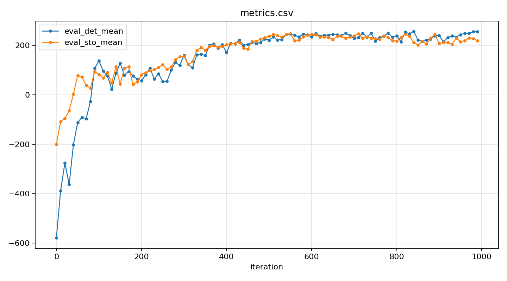
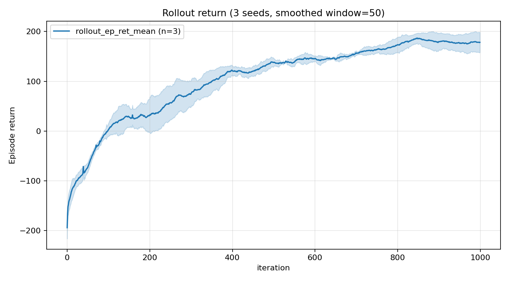

# PPO on LunarLander-v3

From-scratch Proximal Policy Optimization in PyTorch + Gymnasium. Solves LunarLander-v3 in ~2M environment steps with consistent ~257 deterministic eval reward across 3 seeds.




## What this is

PPO is the on-policy, actor-critic algorithm that has become the default for continuous control and robotics RL — it powers Isaac Lab humanoid locomotion, OpenAI Five, ANYmal quadruped controllers, and most published RL-on-robot results since 2017. This implementation is from-scratch — no Stable-Baselines3, no RLLib — and ships with the full set of stabilization techniques that separate working PPO from textbook PPO.

## Key design decisions

All eight standard PPO stabilizers are implemented:

| # | Technique | Why |
|---|---|---|
| 1 | Clipped surrogate objective (`clip = 0.2`) | Soft trust region around the rollout policy |
| 2 | Value function clipping (same range) | Symmetric trust region for the critic |
| 3 | GAE advantage estimation (`γ=0.99`, `λ=0.95`) | Bias-variance knob for the advantage estimator |
| 4 | Per-batch advantage normalization | Scale-invariant policy gradients |
| 5 | Running observation normalization (Welford, clipped to ±10) | Stable inputs for the network |
| 6 | Gradient clipping (max norm 0.5) | Insurance against exploding updates |
| 7 | KL-based early stopping (~0.015) | Data-adaptive trust region — stop epochs when policy drifts |
| 8 | Linear LR + entropy schedules with floors | Aggressive early, fine-tune late, never freeze fully |

Other correctness details that often go silently wrong in amateur implementations:

- **`terminated` vs `truncated` are stored separately.** GAE resets at any episode end (`done = terminated OR truncated`), but only zeros the bootstrap on real terminals. Collapsing them silently biases learning on any task with a time limit.
- **Autoreset bootstrap fix.** When a `gym.vector` env resets mid-rollout, `next_obs` is already the *new* episode's start. We pull the true terminal observation from `info["final_observation"]` for the value-target computation only.
- **Frozen RMS snapshot for evaluation.** Eval observations are normalized by stats snapshotted at evaluation time, mirroring deployment where the normalizer is part of the saved artifact.

## Hyperparameters

| Parameter | Value |
|---|---|
| Environment | `LunarLander-v3` (discrete actions) |
| Parallel envs | 8 (`SyncVectorEnv`) |
| Rollout length | 256 steps/env (= 2048 transitions/iteration) |
| Update epochs | 8 |
| Minibatch size | 256 |
| Clip range | 0.2 |
| Discount γ | 0.99 |
| GAE λ | 0.95 |
| Value-loss coefficient | 0.5 |
| Entropy coefficient | `0.01 → 0.005 → floor 0.0005` (scheduled) |
| Optimizer | Adam (`lr=3e-4 → floor 1e-4`, `eps=1e-5`) |
| Gradient clip | 0.5 |
| KL early-stop threshold | 0.015 |
| Total iterations | 1000 (~2M env steps) |

## Results

Trained over 3 seeds (`0`, `1`, `2`) on CPU. Mean ± std across seeds (last 10 eval points per seed):

| Metric | Mean ± std |
|---|---|
| Final deterministic eval | **257.3 ± 14.5** |
| Final stochastic eval | 249.1 ± 27.5 |
| Best deterministic eval | 270.1 ± 11.3 |
| Wallclock per run | ~41 min (CPU, `SyncVectorEnv`) |
| Total env steps per run | 2,048,000 |

LunarLander-v3 is considered solved at 200+. All 3 seeds converge reliably above 240 by iteration ~400.



## Hardware & runtime

Tested on Python 3.10, torch 2.5+. Training runs CPU-only by default (`SyncVectorEnv` is the bottleneck, not the tiny network). Wallclock ~41 min per seed on a modern CPU; GPU provides no meaningful speedup here. Pass `--device cuda` to use GPU — relevant once you scale to MuJoCo.

## Reproducing

```bash
pip install -e ".[box2d]"   # from repo root

# Train across 3 seeds (~30-35 min each on CPU; can run in parallel terminals)
python ppo/train.py --seed 0
python ppo/train.py --seed 1
python ppo/train.py --seed 2

# Multi-seed plots with mean +/- std bands
python scripts/plot_csv.py --csv "ppo/metrics_seed*.csv" \
    --ys eval_det_mean,eval_sto_mean \
    --title "LunarLander-v3 PPO (3 seeds)" --ylabel "Episode return" \
    --out ppo/plots/eval_curves.png

python scripts/plot_csv.py --csv "ppo/metrics_seed*.csv" \
    --ys rollout_ep_ret_mean --smooth 50 \
    --title "Rollout return (3 seeds, smoothed window=50)" --ylabel "Episode return" \
    --out ppo/plots/rollout_return.png
```

CSV columns logged per iteration: `iteration, env_steps, dt_sec, lr, ent_coef, approx_kl, updates, rollout_ep_ret_mean, rollout_ep_ret_n, eval_det_mean, eval_det_std, eval_sto_mean, eval_sto_std, best_eval_det`.

## What I learned

- The gap between **textbook PPO** and **PPO that converges** is the eight-item stabilizer list above. Removing any single one — especially observation normalization or the `terminated`/`truncated` split — silently degrades or breaks training in ways that are hard to diagnose post-hoc.
- **Vectorized envs are not just throughput.** Eight parallel envs at decorrelated episode phases produce a much better gradient estimate per iteration than 1 env × 8× rollout length.
- **Frozen-RMS evaluation** matters more than expected: without it, eval scores drift even at constant policy quality, which makes "best model" selection unreliable.
- The det-vs-sto eval gap is a useful health metric: if stochastic eval ≫ deterministic eval, the policy is exploiting its own noise and the mode is suboptimal.

## Debugging: Gymnasium 1.0 autoreset regression (commit `5e15932`)

This bug took several training runs to surface and is worth documenting because it is completely silent — no crash, no NaN, just subtly lower scores.

**Background.** When using `gym.vector.SyncVectorEnv`, each sub-env resets automatically when an episode ends. The reset happens mid-rollout, so at the step where episode N ends, `next_obs` returned by `envs.step()` is already the first observation of episode N+1, not the true terminal observation of episode N. To compute the correct GAE bootstrap target `V(s_terminal)` we need the terminal obs — which Gymnasium stores in `infos["final_obs"]`.

**What changed in Gymnasium 1.0.** The default autoreset mode switched from `SAME_STEP` to `NEXT_STEP`:

- **`SAME_STEP` (old default):** reset happens on the same step the episode ends. `next_obs` = reset obs; terminal obs available in `infos["final_obs"]`. The bootstrap fix works correctly with this mode.
- **`NEXT_STEP` (new default):** reset is deferred one step. This silently injects a spurious transition — `(terminal_obs, no-op action, reward=0, next_obs=reset_obs, done=False)` — into the rollout. The bootstrap saw `V(reset_obs)` instead of `V(terminal_obs)`, corrupting the advantage estimate for every episode boundary in the rollout.

The other half of the breakage: the info key was renamed from `final_observation` (Gymnasium <1.0) to `final_obs` (Gymnasium ≥1.0). The old key check silently fell through to `next_obs_for_value = next_obs`, so the fix was never applied even when training on SAME_STEP mode.

**The fix** (two lines):

```python
# pin the autoreset mode so the bootstrap path stays correct
envs = gym.vector.SyncVectorEnv(..., autoreset_mode=gym.vector.AutoresetMode.SAME_STEP)

# updated info key for Gymnasium 1.0+
if isinstance(infos, dict) and "final_obs" in infos:   # was "final_observation"
```

**Why it was hard to catch.** The corrupted transitions only occur at episode boundaries (roughly every 200–400 steps in LunarLander). Each bad bootstrap shifts the advantage estimate by `γ · (V(reset_obs) - V(terminal_obs))`, which is non-zero but small. Training still progresses; it just plateaus ~30–50 points lower. Without a known-good baseline to compare against, you'd attribute the gap to hyperparameters.

## Next

Continuous-action PPO on `HalfCheetah-v4` (MuJoCo) — Gaussian policy head with state-independent `log_std`, reward normalization in addition to obs normalization, same scaffolding otherwise.
