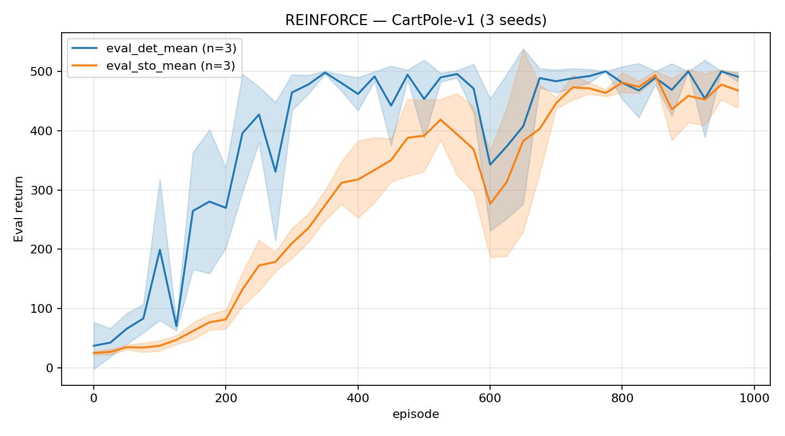
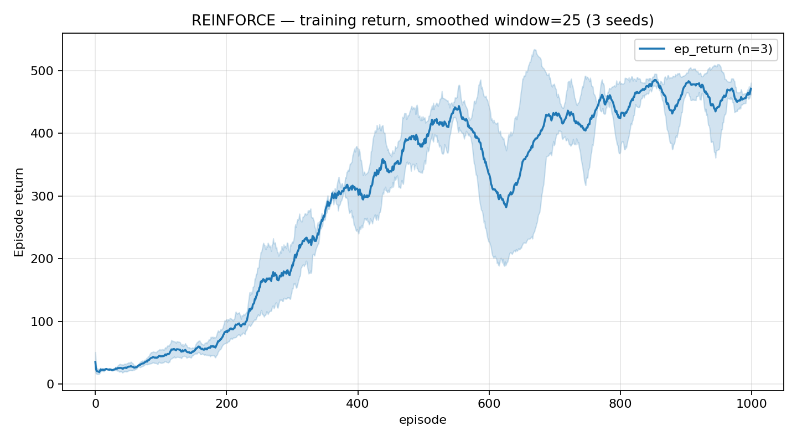

## REINFORCE (CartPole-v1)

From-scratch policy gradient in PyTorch + Gymnasium.





### Run

```bash
# single run (default seed 0, 1000 episodes)
python reinforce/train.py

# specific seed / episode budget
python reinforce/train.py --seed 1 --episodes 1000 --device cpu
```

Install first: `pip install -e .` from repo root.

### Hyperparameters

| parameter | value |
|---|---|
| network | 2-layer MLP, 128 hidden, ReLU |
| γ (discount) | 0.99 |
| learning rate | 1e-3 (Adam) |
| return normalisation | per-episode z-score |
| eval cadence | every 25 episodes, 20 deterministic rollouts |
| eval seed | fixed (12345 + ep) for reproducibility |

### Results — 3 seeds, CartPole-v1

| seed | first solve (ep) | env steps to solve | best det. eval | final det. eval |
|---|---|---|---|---|
| 0 | 350 | 29 226 | 500.0 | 500.0 |
| 1 | 450 | 71 255 | 500.0 | 493.1 |
| 2 | 350 | 43 190 | 500.0 | 479.9 |

"Solve" = deterministic eval ≥ 499 (CartPole-v1 cap is 500). All three seeds reach it; seeds 1/2 show mild oscillation in the final episodes rather than locking in — expected for a high-variance on-policy method with no replay.

### Hardware & runtime

Tested on Python 3.10, torch 2.7. Runs CPU-only; ~3–5 min per seed on a modern CPU.

### Reproducing

```bash
# train 3 seeds
python reinforce/train.py --seed 0
python reinforce/train.py --seed 1
python reinforce/train.py --seed 2

# eval curves (mean ± std across seeds)
python scripts/plot_csv.py --csv "reinforce/metrics_seed*.csv" \
    --x episode --ys eval_det_mean,eval_sto_mean \
    --title "REINFORCE — CartPole-v1 (3 seeds)" --ylabel "Eval return" \
    --out reinforce/plots/eval_curves.png

# training return (smoothed)
python scripts/plot_csv.py --csv "reinforce/metrics_seed*.csv" \
    --x episode --ys ep_return --smooth 25 \
    --title "REINFORCE — training return, smoothed window=25 (3 seeds)" \
    --ylabel "Episode return" \
    --out reinforce/plots/ep_return.png
```

CSV columns logged per episode: `episode, env_steps, dt_sec, loss, ep_return, ep_length, eval_det_mean, eval_det_std, eval_sto_mean, eval_sto_std, best_eval_det`.

### What I learned

**Return normalisation matters more than it looks.** Without z-scoring the episode return, early episodes (short cartpole runs → small raw returns) produce tiny, noisy gradients. Normalising per-episode makes gradient scale consistent regardless of episode length, which is the main reason REINFORCE converges at all on CartPole without a baseline.

**High variance is the fundamental limit.** Each gradient estimate uses a single episode's trajectory. On an episode where the pole happened to survive 400 steps by luck, all actions in that episode get reinforced equally — including the bad ones near the start. This "credit assignment by luck" inflates variance and explains why seeds 1/2 still oscillate even after solving. A baseline (actor-critic) fixes this; REINFORCE is the cleanest version to understand first.

**On-policy means every episode is thrown away.** After one gradient step the policy has changed, so the stored log-probs are stale. There's no replay buffer; data efficiency is inherently worse than DQN. The upside is the update is exact — no approximation from a Q-function.
